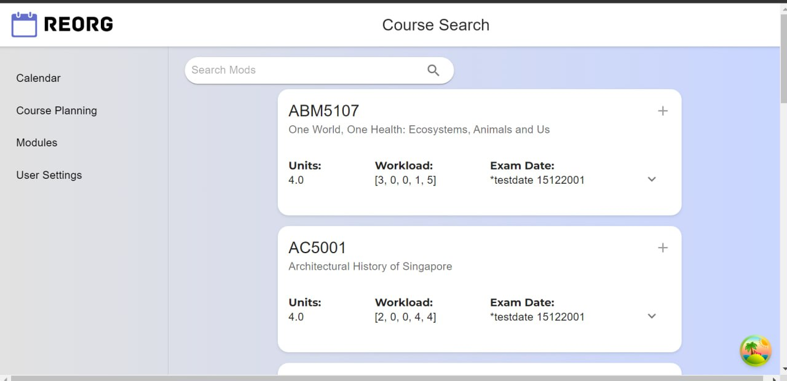
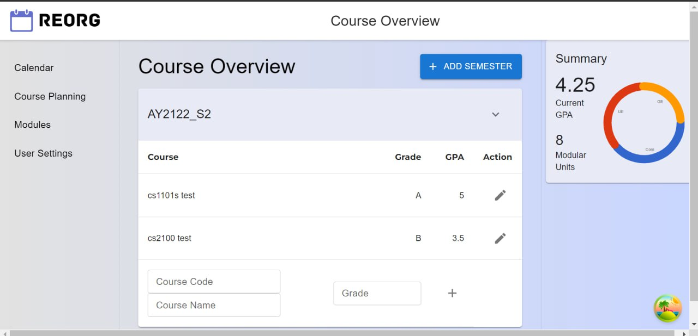

# NUS Orbital 2024 REORG

## Milestone Two

## Abstract':'

This document is a continuation of our proposal, providing additional details and expanding on the ideas outlined previously. It also covers different aspect of our development process such as our design logic, development plan, wireframes. However, the features stated are subjected to changes due to various limitations and challenges we are facing. Thank you for taking the time to read this document. .We welcome any feedback to improve the project further'.'

## Poster:  [6127 Milestone Two Poster](https://drive.google.com/file/d/1TjZjMqfUqIlGZ13LPyIzIVRTZxByi7Kq/view?usp=drive_link)

## Video: [6127 Milestone Two Video](https://drive.google.com/file/d/15cLJNqVhMuNa02uY61Fmm6BE6Oc11HFz/view?usp=drive_link)

## Proposed Level of Achievement: Apollo

## Aim

REORG aims to be an all-in-one academic management platform which allows NUS students to manage their academic schedule, course progress and planning'.'

## Motivation

As university students, we often juggle many commitments. Beyond academics, we have part-time jobs, co-curricular activities, competitions, family responsibilities, and more. Balancing these can make it hard to meet our academic goals.

NUSMOD is a great tool for NUS students to plan their academics. However, it doesn’t help us track our academic progress, such as GPA and course requirements. Many of us end up using different tools like Google Sheets and Microsoft Excel to keep track of our progress. This means switching between platforms to check course requirements and module information.

To simplify this process, we aim to create a course planning platform that integrates resources from the university and NUSMOD. This platform will help NUS students easily plan their courses and track their progress.

Additionally, managing academic commitments would be easier with an integrated calendar. This calendar would allow us to edit and view academic activities, lesson schedules, and important dates like course registration and the academic calendar.

## Vision

REORG will be a powerful tool for NUS students to view and manage their academic activities. By integrating resources like NUSMOD and the university's websites, REORG simplifies course planning and progress tracking. It will help students manage their academic lives more effectively, allowing them to focus on their academic goals with ease.

## User Stories

1. As a student, I can view and manage my academic events such as lesson schedules as well as deadlines for my assignments, so that I can better manage my academic life and not miss out any important deadlines and activities.
2. As a student, I can plan my schedules by adding external events and manage assignment deadlines within each academic semester, so that I can integrate my academic and non-academic life.
3. As a student, I can keep track of my course progress, my course performance over the course, and history of the modules I have taken, so that I know how far I am from meeting my degree requirement and what is my projected GPA at the end of the course.
4. As a student, I can plan modules and take same modules or tutorial with my friends, so that I can have a more enjoyable university life.

## Proposed Features

## Features

### User Account Authentication (completed)

#### Description

Since REORG is a personal academic management platform for the students, every user needs to be authenticated with his/her unique account to access and manage personal data stored on the platform.
In order to ensure secure authentication and authorisation, we decided to use Key Cloak for identity and access management. Together with JWT tokens, Keycloak offers comprehensive security benefits for modern applications, in this case, our web application.
When a user tries to access our web application, he/she is first directed to our log-in page. Then he/she is then redirected to Keycloak login page. The users provide their credentials(e.g. username/email and password) on the Keycloak login page. Keycloak then verifies the credentials against its database or external identity provider. Upon successful authentication, Keycloak generates identity token which contains user information that are required for the application. User will then be directed to our main dashboard.

#### Implementation Philosophy

Keycloak provides a centralized authentication and authorization server, managing user credentials, roles, and permissions in one place, which simplifies security management across services. It enhances scalability and performance by offloading authentication tasks and utilizing stateless, self-contained JWT tokens, which reduce latency.
Additionally, it's robust security features, such as password policies and two-factor authentication, combined with JWT's cryptographic signatures and expiration times, ensure strong protection against unauthorized access and replay attacks. The centralized management of access controls in Keycloak, along with the flexible, language-agnostic nature of JWT tokens, ensures consistent and efficient enforcement of security policies. Additionally, Keycloak supports standard protocols like OAuth 2.0 and OpenID Connect, enabling seamless integration with various applications, while also offering single sign-on (SSO) for an improved user experience. Overall, Keycloak and JWT tokens provide a robust, scalable, and user-friendly security solution for modern applications.

### Calendar (partially completed)

#### Description

Our academic calendar is based on react-big-calendar component which enables different user view options and customised styling and tool bar. 
Customised Tool bar:
1. Zoom in and out to have a better view of multiple events in one single timeslot
2. Date picker to jump to specific date
3. Today button to return to today
4. Previous and next toggle buttons to toggle to the previous/next day/week/month
5. View options for user to view events in different layout 
User view options:
1. Day
2. Week
3. Month
4. Agenda (in progress)

#### Implementation Philosophy

Calendars are important for students. It is useful in time management, deadline tracking, organisation of events, and provides a visual reminder of our commitments, plans and schedules. 
Our design and implementation philosophy revolves around simplicity, accessibility and integration, aiming to enhance productivity and organisation of academic commitments. 
Users can view the events in 4 different formats which are useful for daily, weekly and monthly personal planning. Calendar is simplistic and intuitive. 

### Module (completed)

#### Description

As part of the academic management platform for NUS students, we include a collection of module information that are available for current academic year.
A search function is in place to allow users to search for modules with module code matched with user input. 
Furthermore, together with Course Progress Tracker (see Course Progress), the modules are tagged to indicate if it is required based on user’s course profile.

#### Implementation Philosophy

The main motivation here is to provide user with a database of modules available. Additionally, our original plan includes a modular tree that allows users to see the modules required to unlock certain module and the modules unlocked after completion of the selected module. 

### Course Progress (partially completed)

#### Description

This is the core feature of REORG, to allow users to keep track of their course progress and modules that they have taken. 
Users will be able to set up their course profile to include degree requirements, such as the number of modular units they have to complete, the compulsory modules need to be taken etc. 
Users can input their semester information on the modules taken with grades. GPA by semester is automatically calculated. 
An overall GPA will be displayed based on user input, as well as the accumulated modular units completed. 

#### Implementation Philosophy

The main motivation of this feature is to provide users with a course tracker. It would allow users to view what are the modules they have taken. Possible extensions include schedule display similar to NUSMOD when planning for new semester.

## SWE Practices

### Version Control

Our team uses git for version control and for management of codebases. It helps us to track changes, collaborate effectively, and maintain code quality. By leveraging branching and merging, we can work on different features and fixes bugs in isolation, ensuring a stable main branch.
With meaningful commit messages and the use of remote repositories, we collaborate effectively. We make small and frequent commits to ensure single logical changes. We regularly clean up our working directory and use ‘.gitignore’ to exclude unnecessary files.

### Architecture and Design

#### API Design

We use Java Spring Boot to build our REST API. A layered architecture is followed where we organise the application into 4 different layers: controller, services, repository and entities. This ensures modularity as each layer has a specific responsibility and easier to maintain. 

Below showcase the relevant controllers (subject to changes) needed for our project:

#### Microservice Design

Our team has opted for using the microservice design in our API to ensure easy expandability of code and to make sure that we can both pair code simultaneously without creating bugs that affect the others testing. By separating our API into small and simple service, as opposed to the traditional monolithic coding structures, we can also help each other easily vet and bug fix each other code, ensuring robustness of our system.
This architecture also provides technology flexibility, allowing different services to use the most suitable tools and languages. Microservices facilitate better maintainability with modular codebases, making updates and replacements easier. This may be extra useful when it comes to our additional features where we would like to graphically showcase the pre-requisite tree of courses. In such a case, the use of a database like Neo4j would be more suitable compared to MySQL (most of our app is run on).
Currently our API is split into different services,
• Calendar: Handles all methods related to the Calendar (main body of the app) such as adding events, updating datetime of events, etc.
• Course-Details: Handles the Mod search feature, responsible for handling API calls to NUSMod API, handles mutating and packaging mod information for frontend.
• Grade-Overview: Handles calculation of user over grades and statistics, stores and retrieves a list of users taken courses based on their previous inputs.
• Journal: Handles all API methods related to journaling and journal entry
• User-Settings: Handles all API methods related to User Settings.
• API-gateway (Covered below)
• Discovery-service (Covered below)

#### Discovery Service

Currently, with the app all hosted locally, we could hardcode the internal API calls to their respective URIs. However, should the app be docked and hosted on the cloud, this would prove difficult as we must set up IP addresses of our environment and load balancing would also prove to be difficult. To circumvent this, we opted to make use of Spring Netflix Eureka Discovery Server to help with the management of load balancing and registering instances of our API for calling.
A discovery service is essential in a microservice architecture as it dynamically locates services by automatically registering and deregistering them, ensuring clients can find the necessary services without hard-coding addresses. It aids in load balancing by distributing requests across service instances and enhances fault tolerance by rerouting traffic if an instance fails. This service also simplifies centralized management by reducing configuration complexity and integrates with security mechanisms to control access. Additionally, it performs health checks to monitor service status, ensuring clients connect only to healthy instances, thereby improving resilience and manageability.

#### API Gateway

With a microservice style architecture, it would prove difficult to remember the different IP for the frontend to call, that is why we created an API gateway. The gateway acts as a buffer between the client and the rest of the API, routing method calls to the right place, load balancing the system as well as acting as a layer of security.
To future proof the system, the API gateway can also be retrofitted to throttle, and rate limit the system to prevent the API to be overwhelmed should our user base grow to a larger size. This could be an additional goal to thrive for by milestone 3.

### Entity Relationship Diagram (ERD) (subject to changes)

REORG uses a relational database to manage the data needed for operations such as user authentication, storage of user course profile, journal entries as well as module details. By using a relational database, we can ensure data integrity and support complex query needed for the wed app.
The database contains several interrelated tables which is shown the ERD below:

## Initial Wireframe

## User Interface Design (Still in progress)

### Site Map

### Sign In Page

### Sign Up Page

### Main Dashboard

#### Calendar

.jpg)

#### Modules

#### Course Progress

## Sign In User Flow (subject to changes)

## Timeline and Development Plan (subject to changes)

## Tech Stack':'

• React Typescript (frontend)
• Java Spring Boot (backend, RESTful API)
• MySQL (relational database)

## Project Log':'

[Orbital24-6127-REORG](https://docs.google.com/spreadsheets/d/17JS7bcnGZdaE_93xDu4N9nRWD4szjpai-7lixYyifF0/edit?usp=sharing)

## Team REORG

Guo Siyan (e1121718)
Thaddeus Lim Yu Han (e1300478)
